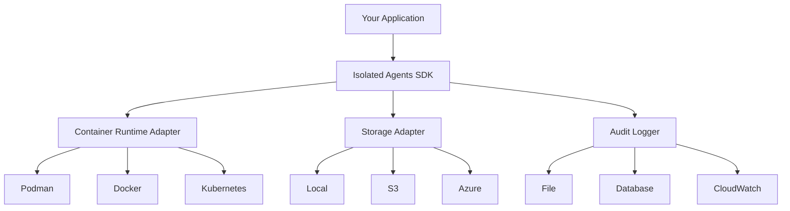

# Isolated Agents SDK

<div align="center">
  
  <p><strong>Production-ready SDK for running AI agents in isolated containers</strong></p>
  <p>
    <a href="https://github.com/Tech-Vexy/Isolated-Agents"></a>
    <a href="https://pypi.org/project/isolated-agents-sdk/"></a>
    <a href="https://pypi.org/project/isolated-agents-sdk/"></a>
    <a href="https://github.com/Tech-Vexy/Isolated-Agents/blob/main/LICENSE"></a>
  </p>
</div>

---

## What is Isolated Agents SDK?

The **Isolated Agents SDK** is a production-ready framework for running AI agents in **secure, isolated containers**. It provides:

- 🔒 **Security-first design** with container isolation
- 🎯 **Simple API** with Pythonic decorators
- 🔌 **Pluggable architecture** with adapter pattern
- 🌐 **Framework agnostic** - works with any AI framework
- 🚀 **Production-ready** with comprehensive monitoring
- 📦 **Cross-platform** support (Linux, macOS, Windows)

---

## Quick Example

```python
from isolated_agents_sdk import run_agent, Policy, NetworkPolicy

def my_agent():
    """Your agent code runs in an isolated container."""
    from langchain_openai import ChatOpenAI
    from pathlib import Path
    
    llm = ChatOpenAI(model="gpt-4")
    result = llm.invoke("Explain quantum computing")
    
    # Save output
    Path("/output/response.txt").write_text(result.content)

# Run agent in isolated container
result = run_agent(
    agent=my_agent,
    working_dir="./workspace",
    host_output_path="./output",
    policy=Policy(
        network=NetworkPolicy(disabled=False),
        allowed_env_vars=["OPENAI_API_KEY"],
        pip_packages=["langchain-openai"],
    )
)

print(result.artifacts["response.txt"])
```

---

## Key Features

### 🔒 Security & Isolation

- **Container isolation** - Each agent runs in its own container
- **Network policies** - Fine-grained network access control
- **Resource limits** - CPU, memory, and timeout constraints
- **Read-only filesystem** - Immutable container environment
- **Audit logging** - Complete audit trail of all operations

### 🎯 Developer Experience

- **Simple API** - Intuitive Python interface
- **Decorator support** - Clean, Pythonic code
- **Type safety** - Full type hints and validation
- **Error handling** - Comprehensive error messages
- **Hot reload** - Fast development iteration

### 🔌 Extensibility

- **Adapter pattern** - Pluggable container runtimes (Podman, Docker, K8s)
- **Storage adapters** - Local, S3, Azure, GCS
- **Logger adapters** - File, database, cloud logging
- **Custom adapters** - Easy to extend

### 🌐 Framework Support

Works with **any** AI framework:

- **LangChain** - Full support with examples
- **CrewAI** - Multi-agent orchestration
- **AutoGPT** - Autonomous agents
- **LlamaIndex** - RAG and document processing
- **Haystack** - NLP pipelines
- **Semantic Kernel** - Microsoft's AI framework
- **Custom frameworks** - Bring your own

### 🚀 Production Features

- **Composability** - Chain agents together
- **Multimodal outputs** - Text, images, audio, video
- **Validation** - Output validation and testing
- **Telemetry** - Real-time monitoring
- **Auto-scaling** - Horizontal scaling support
- **Cross-platform** - Linux, macOS, Windows

---

## Use Cases

### 🕷️ Web Scraping

Run web scraping agents with network isolation and rate limiting.

```python
@isolated_agent
@network(allowed_endpoints=["example.com:443"])
def scraper():
    import requests
    from bs4 import BeautifulSoup
    # Scraping logic...
```

### 📊 Data Analysis

Process sensitive data in isolated environments.

```python
@isolated_agent
@resources(memory_mb=4096, cpu_cores=4.0)
def analyzer():
    import pandas as pd
    # Analysis logic...
```

### 🤖 Multi-Agent Systems

Orchestrate multiple agents with different permissions.

```python
@chain(agents=[researcher, writer, editor])
def content_pipeline(topic: str):
    """Complete content creation pipeline."""
    pass
```

### 🔐 Secure Code Execution

Execute untrusted code safely in containers.

```python
@isolated_agent
@policy(network=NetworkPolicy(disabled=True))
def code_executor(code: str):
    exec(code)  # Safe in isolated container
```

---

## Architecture



---

## Why Isolated Agents SDK?

### Security

Traditional AI agents run in your application's process, with full access to:
- ❌ Your filesystem
- ❌ Your network
- ❌ Your environment variables
- ❌ Your credentials

**Isolated Agents SDK** runs each agent in a container with:
- ✅ Isolated filesystem
- ✅ Controlled network access
- ✅ Limited resources
- ✅ No access to host credentials

### Reliability

- **Resource limits** prevent agents from consuming all resources
- **Timeouts** prevent infinite loops
- **Crash isolation** - one agent crash doesn't affect others
- **Audit logging** for debugging and compliance

### Flexibility

- **Framework agnostic** - use any AI framework
- **Language agnostic** - Python, Node.js, Go, Rust, Java
- **Pluggable** - swap container runtimes, storage, logging
- **Composable** - chain agents together

---

## Getting Started

### Installation

```bash
pip install isolated-agents-sdk
```

### Prerequisites

- Python 3.11+
- Podman or Docker

### Quick Start

1. **Install the SDK**
   ```bash
   pip install isolated-agents-sdk
   ```

2. **Write your first agent**
   ```python
   from isolated_agents_sdk import run_agent, Policy
   
   def hello_agent():
       print("Hello from isolated container!")
   
   result = run_agent(agent=hello_agent, policy=Policy())
   ```

3. **Run it**
   ```bash
   python my_agent.py
   ```

See the [Getting Started Guide](getting-started.md) for more details.

---

## Documentation

- **[Getting Started](getting-started.md)** - Installation and first steps
- **[Adapter Architecture](ADAPTER_ARCHITECTURE.md)** - Understanding the SDK
- **[Architecture](ADAPTER_ARCHITECTURE.md)** - System design
- **[Examples](EXAMPLES_CATALOG.md)** - 81+ working examples
- **[Extending Adapters](EXTENDING_ADAPTERS.md)** - Implementation guides

---

## Examples

### LangChain Agent

```python
from isolated_agents_sdk import isolated_agent, network

@isolated_agent
@network(enabled=True)
def langchain_agent():
    from langchain_openai import ChatOpenAI
    llm = ChatOpenAI(model="gpt-4")
    result = llm.invoke("Explain AI safety")
    return result.content
```

### Multi-Agent Pipeline

```python
from isolated_agents_sdk import chain

@chain(agents=[researcher, writer, editor])
def content_pipeline(topic: str):
    """Research → Write → Edit"""
    pass

result = content_pipeline("AI Safety")
```

### Data Analysis

```python
from isolated_agents_sdk import isolated_agent, resources

@isolated_agent
@resources(memory_mb=4096, cpu_cores=4.0)
def analyze_data():
    import pandas as pd
    df = pd.read_csv("/workspace/data.csv")
    return df.describe()
```

See [all examples](EXAMPLES_CATALOG.md) for more.

---

## Community

- **[GitHub](https://github.com/Tech-Vexy/Isolated-Agents)** - Source code and issues
- **[Discord](https://discord.gg/isolated-agents)** - Community chat
- **[Twitter](https://twitter.com/isolated_agents)** - Updates and news
- **[Forum](https://community.isolated-agents.dev)** - Discussions

---

## Contributing

We welcome contributions! Please see our GitHub repository for more details.

---

## License

Isolated Agents SDK is licensed under the MIT License.

---

## Support

- **Documentation**: [docs.isolated-agents.dev](https://docs.isolated-agents.dev)
- **Issues**: [GitHub Issues](https://github.com/Tech-Vexy/Isolated-Agents/issues)
- **Discord**: [Join our community](https://discord.gg/isolated-agents)
- **Email**: support@isolated-agents.dev

---

<div align="center">
  <p>Made with ❤️ by the Isolated Agents team</p>
  <p>
    Built with <a href="https://bob.ibm.com" target="_blank" rel="noopener">IBM BOB</a> 
    
  </p>
  <p>
    <a href="https://github.com/Tech-Vexy/Isolated-Agents">GitHub</a> •
    <a href="https://docs.isolated-agents.dev">Documentation</a> •
    <a href="https://discord.gg/isolated-agents">Discord</a> •
    <a href="https://twitter.com/isolated_agents">Twitter</a>
  </p>
</div>